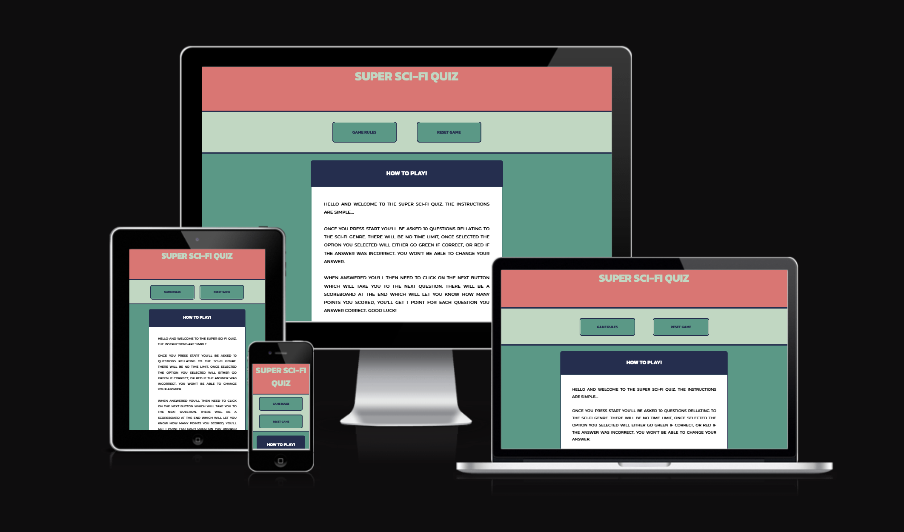

# Super Sci-Fi Quiz

## Contents

* [User Experience](#user-experience)

* [Design](#design)
  * [Typography](#typography)
  * [Colour Scheme](#colour-scheme)
  * [Wireframes](#wireframes)
  * [Imagery](#imagery)
  * [Features](#features)
  * [Accessibility](#accessibility)

* [Technologies Used](#technologies-used)
  * [Languages](#languages)
  * [Frameworks and Libraries](#frameworks-and-libraries)

* [Deployment and Local Development](#deployment-and-local-development)
  * [Deployment](#deployment)
  * [Local Development](#local-development)
    * [How to Fork](#how-to-fork)
    * [How to Clone](#how-to-clone)

* [Testing](#testing)
  * [HTML Validation](#html-validation)
  * [CSS Validation](#css-validation)
  * [JavaScript Validation] (#javascript-validation)
  * [Bugs](#bugs)
  * [Resolutions](#resolutions)
  * [Known Bugs](#known-bugs)
    * [All Pages - Mobile](#all-pages---mobile)
    * [All Pages - Desktop](#all-pages---desktop)

* [Credits](#credits)
  * [Code](#code)
  * [Content](#content)
  * [Media](#media)
  * [Acknowledgements](#acknowledgements)

- - -

## User Experience

* User Experience

- - -

## Design

## Typography

I carefully chose two fonts for this project as I didn't want to use too many and make the project look cluttered, I imported these to my CSS file from Google Fonts.

* Type

## Colour Scheme

Like with the fonts I didn't want to have too many colours but wanted enough for contrast in different areas of the website and opted to use 8 colours in my project. 

## Wireframes

### Imagery

### Features

* Navigation Menu

  * When I started working on this project I knew that I wanted to have a single page with elements that would be hidden when different buttons were used.

  * Every page will have the same format and I started this by incorporating a navigation menu which will link to the id of the section I wished to show when clicking on the right buttons.

### Accessibility

## Technologies Used

### Languages

This website was built using HTML, styled with CSS and JavaScript was used to program the website based on the users actions.

### Frameworks and Libraries

* [Gitpod](https://www.gitpod.io/) - Used as the workspace implement changes to my website.
* [Github](https://github.com/) - Used to store and build my repository and to deploy my website.
* [Google Developer Tools](https://developer.chrome.com/docs/devtools) - To allow me to find out what might be preventing the bugs in my code.
* [Google Fonts](https://fonts.google.com/) - I used the fonts 'Kanit', and 'Montserrat'.
* [Balsamiq](https://balsamiq.com/) - I used Balsamiq to produce wideframes for my website and give me an idea of what might work and what might not.
* [Font Awesome](https://fontawesome.com/) - Font Awesome was used to download the icons for my navigation and social media links.
* [Am I Responsive?](https://ui.dev/amiresponsive) - Used to show how the webiste will look on different device types.
* [StackOverflow](https://stackoverflow.com/) - Used to troubleshoot and for help with understanding concepts.
* [W3Schools](https://www.w3schools.com/) - Used to troubleshoot and for help with understanding concepts.

## Deployment and Local Development

### Deployment

As we're using Github to deploy the site we'll do this through pages.

1. First, you'll go to [Github](https://github.com)
2. Then you'll need to find the correct repository, for this project it will be [Super Sci-Fi Quiz](https://n-ste.github.io/Super_Sci-Fi_Quiz/)
3. You'll then go to the [settings]() page at the top of the screen.

4. When on the settings page there will be a [sidebar]() on the left of the screen, click the link that says "Pages"
5. Now at the top of the page you'll want to select the option to "Deploy page from branch"
6. Select the ["main" branch from the"/root"]() file and click save.
7. The [site will now be ready]() to be deployed.

## Local Development

### How to Fork

1. To fork the repository you'll first need to go to [Super Sci-Fi Quiz](https://n-ste.github.io/Super_Sci-Fi_Quiz/)
2. At the top of the page there will be a button that says ["Fork"](), click on this.

### How to Clone

1. To clone the repository first you'd need to visit the [repository page.](https://n-ste.github.io/Super_Sci-Fi_Quiz/)

2. You'd then click the green button that says ["Code"](), this should open a box which will say "Clone" on it. Copy the Link that appears.

3. Then you can go to your terminal and type "git clone (paste in the link that you copied earlier) and you should have successfully cloned the repository.

## Testing

### HTML Validation

* [Home Page HTML]()

### CSS Validation

* [Stylesheet]()

### JavaScript Validation

* [JavaScript]()

### Bugs

### Resolutions

### Known Bugs

#### All Pages - Mobile

#### All Pages - Desktop

## Credits

### Code

### Content

### Media

### Acknowledgements

I'd like to give a special mention to my mentor Jubril Akolade for providing me with advise and feedback on this project.