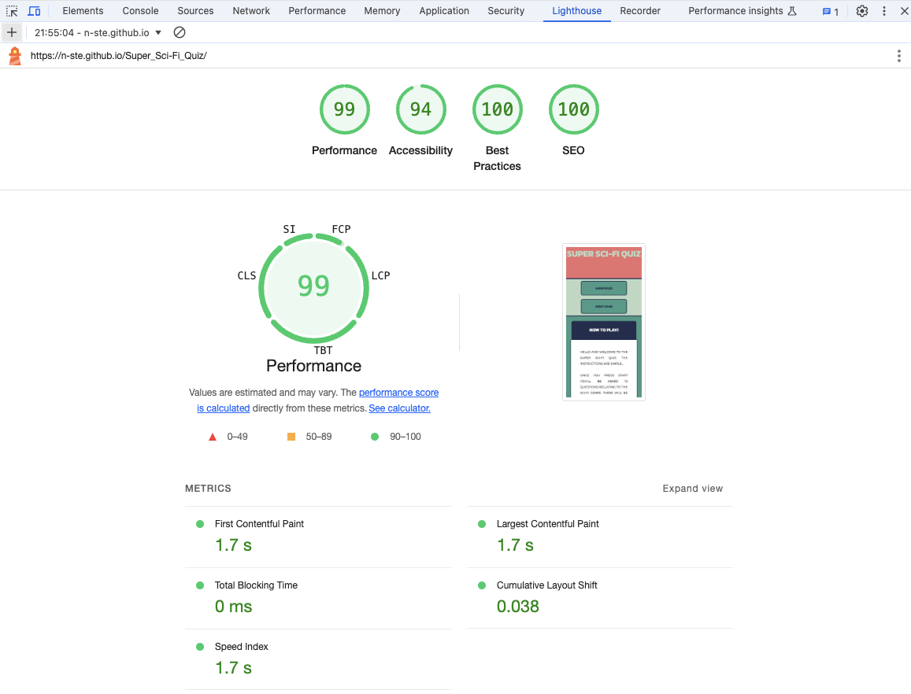

# Super Sci-Fi Quiz

## Contents

* [User Experience](#user-experience)

* [Design](#design)
  * [Typography](#typography)
  * [Colour Scheme](#colour-scheme)
  * [Wireframes](#wireframes)
  * [Imagery](#imagery)
  * [Features](#features)
  * [Accessibility](#accessibility)

* [Technologies Used](#technologies-used)
  * [Languages](#languages)
  * [Frameworks and Libraries](#frameworks-and-libraries)

* [Deployment and Local Development](#deployment-and-local-development)
  * [Deployment](#deployment)
  * [Local Development](#local-development)
    * [How to Fork](#how-to-fork)
    * [How to Clone](#how-to-clone)

* [Testing](#testing)
  * [HTML Validation](#html-validation)
  * [CSS Validation](#css-validation)
  * [JavaScript Validation](#javascript-validation)
  * [Bugs](#bugs)
  * [Resolutions](#resolutions)
  * [Known Bugs](#known-bugs)

* [Credits](#credits)
  * [Code](#code)
  * [Content](#content)
  * [Media](#media)
  * [Acknowledgements](#acknowledgements)

- - -

## User Experience

* In this project my goal was to create a simple quiz website that a user would answer the questions to and be provided with feedback during and after the quiz to let them know how well they did.
* I chose to do this as a single scrolling page with elements that would appear and disappear depending on the buttons they clicked on.

- - -

## Design

## Typography

I carefully chose two fonts for this project as I didn't want to use too many and make the project look cluttered, I imported these to my CSS file from Google Fonts.

* The first font I chose was 'Kanit', and it's weight was set to 700. This font reminded me of something that would be quite popular in the 80s which I found fitting as this was a big decade for the sci-fi genre which is was the quiz was primarily based on.

* The second and final font I chose was 'Montserrat', in it's standard weight of 400. I chose this as I'd used it in past projects and I liked the way it looked and found it complemented 'Kanit', I used this for the paragraphs and main text included in the project.

## Colour Scheme

Like with the fonts I didn't want to have too many colours but wanted enough for contrast in different areas of the website and opted to use 6 colours in my project.

* The first colour I used in the project was #E87070 which is an orange-red colour, I used this for the header to start the project off with a bold colour. I paired this with a font colour for the main heading of #BCD8C1, which is a minty pistachio colour.

* I also used #BCD8C1 for the background for the nav section as I liked the contrast between the light green and the darker green buttons on the nav section. The other time i used this colour was for the background of the the question container as it made the page feel more busy than if I was to leave it blank and make it seem like there might be something missing from the page.

* The next colour I used was #222E50, this is more of a navy blue colour. I used this for the nav buttons as the border and font colour, and then the colours invert when the user hovers over these. I also used this colour for the bottom borders in my page and for the background for the question, question answer options headings, and font colour and border colour for the next and submit buttons. These colours also invert when the user hovers over these buttons so the background for the button becomes blue.

* I chose to incorporate #ffffff, which is the lightest white shade. This is first used as the font colour for the question heading, answer option border and font colour, and  background colour for the questions, username container and final score result.

* I used #439A86, for the background colour of the nav buttons and quiz container background colour. This is more of a forest green so it wasn't too similar with the colour I used for the background of the nav area.

* The final colour that is used is #E9D985, which is a bright mustard colour. This is mainly used as the background colour of the submit and next question questions. I also used this for the quiz when giving the user a live display of their cumulative score as they answer the questions.

## Wireframes

* I've opted to have the design look very similar on all devices to remain the classic look while still managing to be accessible.

* For the mobile view there will be less margin space so that the content doesn't appear too cramped. With the tablet view the margins will get wider, and I took this same  principle with the laptop and desktop screen displays.

### Imagery

* As I was going for a more 80s look, I opted not to use any images in this project, with the exception of the favicon. For this, I chose to use an alien gaming emoji as this would fit in with the theme of the project.

### Features

#### Navigation

* When I started working on this project I knew that I wanted to have a single page with elements that would be hidden when different buttons were used.

* Every page will have the same format and I started this by incorporating a navigation menu which will link to the id of the section I wished to show when clicking on the right buttons.

#### Instructions Page

* I decided to start the project by incorporating an area to explain the rules of the game. This feaured a box explaining the scoring system and what the feedback the user will recieve when they answer correctly and incorrectly.

#### Correct and Incorrect Answer Feedback

* For giving customer feedback I wanted to ensure that the user will know as soon as they've answered the question. I did this by changing the background colour of the answer.

* If the user answered the question correctly the background colour would change to green and the score value on the banner would go up by 1 point.

* If the user answered the question incorrectly then the background of the button would change to red.

#### Username Form and Score Result Alert

* At the end of the quiz after the submit button has been clicked the user will then see a form on the webpage advising them to submit a username to see their result.

#### Score Result Alert

* When the user submitted their username they should then see a small window appear on the screen advising what the result of their quiz would be.

### Accessibility

* One of my main goals was to make this website as accessible as possible and I did this by:
  * Using semantic selectors in my HTML through the use of an aria-label to allow the links to be read aloud for those using screen readers.
  * Providing the website with a fallback font for if the browser the user was using wouldn't load the page as it was initially designed.
  * Using contrasting colours for the background, section and headings.

## Technologies Used

### Languages

This website was built using HTML, styled with CSS and JavaScript was used to program the website based on the users actions.

### Frameworks and Libraries

* [Gitpod](https://www.gitpod.io/) - Used as the workspace implement changes to my website.
* [Github](https://github.com/) - Used to store and build my repository and to deploy my website.
* [Google Developer Tools](https://developer.chrome.com/docs/devtools) - To allow me to find out what might be preventing the bugs in my code.
* [Google Fonts](https://fonts.google.com/) - I used the fonts 'Kanit', and 'Montserrat'.
* [Balsamiq](https://balsamiq.com/) - I used Balsamiq to produce wideframes for my website and give me an idea of what might work and what might not.
* [Font Awesome](https://fontawesome.com/) - Font Awesome was used to download the icons for my navigation and social media links.
* [Am I Responsive?](https://ui.dev/amiresponsive) - Used to show how the webiste will look on different device types.
* [StackOverflow](https://stackoverflow.com/) - Used to troubleshoot and for help with understanding concepts.
* [W3Schools](https://www.w3schools.com/) - Used to troubleshoot and for help with understanding concepts.

## Deployment and Local Development

### Deployment

As we're using Github to deploy the site we'll do this through pages.

1. First, you'll go to [Github](https://github.com)
2. Then you'll need to find the correct repository, for this project it will be [Super Sci-Fi Quiz](https://n-ste.github.io/Super_Sci-Fi_Quiz/)
3. You'll then go to the [settings](./assets/docs/deploy-settings.png) page at the top of the screen.

4. When on the settings page there will be a [sidebar](./assets/docs/deployment-sidebar.png) on the left of the screen, click the link that says "Pages"
5. Now at the top of the page you'll want to select the option to "Deploy page from branch"
6. Select the ["main" branch from the"/root"](./assets/docs/depoyment-from-branch.png) file and click save.
7. The [site will now be ready](./assets/docs/deployment-live.png) to be deployed.

## Local Development

### How to Fork

1. To fork the repository you'll first need to go to [Super Sci-Fi Quiz](https://n-ste.github.io/Super_Sci-Fi_Quiz/)
2. At the top of the page there will be a button that says ["Fork"](./assets/docs/fork-icon.png), click on this.
3. When on this page, there will be a heading that says "Create a new fork", you should now select a new repository name.
4. After this, you should go to the bottom of the page and there will be a button that says ["create fork".](/assets/docs/how-to-clone.png)
5. You should then be led to a page that looks like the original repository and the the project has been successfully forked.

### How to Clone

1. To clone the repository first you'd need to visit the [repository page.](https://n-ste.github.io/Super_Sci-Fi_Quiz/)

2. You'd then click the green button that says ["Code"](./assets/docs/how-to-clone.png), this should open a box which will say "Clone" on it. Copy the Link that appears.

3. Then you can go to your terminal and type "git clone (paste in the link that you copied earlier) and you should have successfully cloned the repository.

## Testing

### HTML Validation

* One error appeared when I validated the HTML code through W3. This was due to a heading being present in the HTML file without any content.

### CSS Validation

* There were no errors that came up when I validated my CSS file through W3 Jigsaw. However, there was one warning stating that "Imported style sheets are not checked in direct input and file upload modes."

### Javascript Validation

* No errors came back on JSHint. But there were 35 warnings in total advising "arrow function syntax (=>)' is only available in ES6 (use 'esversion: 6').", "'let' is available in ES6 (use 'esversion: 6') or Mozilla JS extensions (use moz).", "'const' is available in ES6 (use 'esversion: 6') or Mozilla JS extensions (use moz)." However, after revieiwing this with my mentor it was explained this was normal and nothing to be worried about.

### Bugs

### Resolutions

#### HTML

* No issues to be resolved with the HTML file. Though this heading is empty, this will later be added through the use of JavaScript functions. No further changes required.

#### CSS

* No issues were found with the CSS file. However, there was a warning issued stating "Imported style sheets are not checked in direct input and file upload modes." After researching into this I discovered this is nothing to worry about and more of a declaration.

#### Lighthouse

* When I ran the checks though Lighthouse it cam back that the performance was rated 99, the accessability was 94, best practices at 100, and SEO at 100. Due to this I made no amendments.

#### JavaScript

* No issues came from the JavaScript validation. However, there were errors with my JavaScript which I will touch on in the known bugs section.

### Known Bugs

* HTML
  * Empty heading on line 83, this will later have content added through JavaScript and therefore no further action is required.

* CSS
  * 1 warning was found stating "Imported style sheets are not checked in direct input and file upload modes." But after researching this found there is nothing of concern with this and no amendments are required.

* JavaScript
  * There are 2 issues that I'm aware of in my JavaScript. The first on is to do with the score counting. When playing the game there will be a delay in the score going up if you get the answer correct. This usually appears after the next question, I've researched and adjusted my code for this but I've been unable to get the the root of the issue. There were attempts to resolve this but they ended up in the score not tracking at all. For this reason I've left it as it is with the hope to diagnose and resolve this in the future. But I will note that when the score is submitted the accurate result is generated.
  * The second fault I was unable to validate the form at the end of the project where the user is asked to submit their name before receiving the results. I tried to resolve this, but unfortunately this ended in the page crashing and not showing the results all together, whether or not a name was submitted. But again like the other bug this is something I look to resolve in the future.

## Credits

### Code

* [Youtube -  Build A Quiz Website Using HTML, CSS & JavaScript (Part 2) - Live Blogger](https://n-ste.github.io/Super_Sci-Fi_Quiz/)
  * I used the above video to aid me in trying to figure out a way to pull my questions and answers from the array to be displayed when their function was called.

### Content

* [Kwizzbit - 50 Sci-Fi Quiz Questions and Answers](https://kwizzbit.com/sci-fi-quiz-questions-and-answers/)

### Media

* No media was used in this project.

### Acknowledgements

I'd like to give a special mention to my mentor Jubril Akolade for providing me with advise and feedback on this project.
